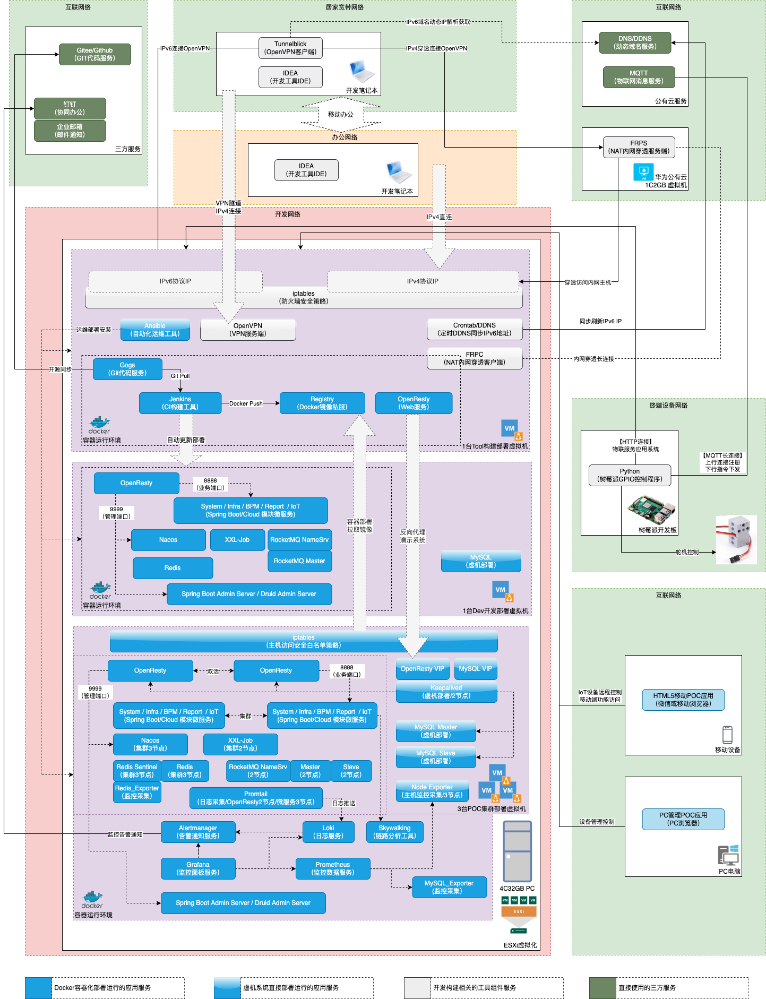

# 项目简介

* 从开发构建环境搭建到交付部署运维的完整DevOps过程POC
* 基于Vue和Spring Cloud前后端微服务分离架构开发框架
* 基于Ansible的开发构建环境搭建及生产交付的一键安装部署脚本
* 信创国产化支持：已适配TongWeb 7，统信UOS V20 amd64，银河麒麟 V10 amd64，CentOS 7.9 arm64
* 基于开发框架的树莓派Python+MQTT的IoT物联网"远程乌龟投喂"娱乐项目

除了单纯的写代码，如果你希望有能力借助一套Java流行开发框架，从零开始搭建一整套研发环境，运用DevOps理念进行研发构建和管理， 专业高效的进行项目交付， 快速成长为开发Leader，欢迎关注本项目。

## 项目主站

* 文档站点： **[http://doc.entdiy.xyz:8800](http://doc.entdiy.xyz:8800)**
* 演示站点： **[http://poc.entdiy.xyz:8888](http://poc.entdiy.xyz:8888)**

> 请注意文档和演示站点出于分离配置考虑，域名和端口均不同！由于IPv6直连访问受限运营商屏蔽80和443等标准端口，因此暂时使用非标端口访问，敬请理解。

主要资料链接：

* [在线体验](http://doc.entdiy.xyz:8800/demo/intro/) - 在线体验地址访问链接信息列表
* [截图展示](http://doc.entdiy.xyz:8800/demo/screenshot/) - 应用主要界面截图展示了解项目全貌
* [技术资料](http://doc.entdiy.xyz:8800/project/infra/) - 技术全景/项目介绍/一键部署指南
* [开源说明](http://doc.entdiy.xyz:8800/tech/intro/) - 关于开源项目的内容和运营规划介绍
* [项目定制](http://doc.entdiy.xyz:8800/tech/tool/) - 基于通用开源项目生成开箱即用的定制项目
* [示例项目](http://doc.entdiy.xyz:8800/tech/iot/) - 基于开发框架的"远程乌龟投喂"娱乐项目介绍
* [远程开发](http://doc.entdiy.xyz:8800/guide/remote/) - 基于开源项目经验打造丝滑的远程开发体验分享

# 技术全景概览

## 部署全景图

## 信创国产化支持

| 分类    | 组件或服务         | 已适配                                                                 |
|-------|---------------|---------------------------------------------------------------------|
| CPU架构 | amd64/x86_64  | 统信UOS V20, 银河麒麟 V10, CentOS V7.9                                    |
|       | arm64/aarch64 | CentOS-7-aarch64-Minimal-2009.iso (QEMU 7.0 模拟安装运行)                                       |
| 操作系统  | 统信UOS         | uos-server-20-1060e-amd64.iso                                       |
|       | 银河麒麟          | Kylin-Server-10-SP1-Release-Build20-20210518-x86_64.iso             |
|       | CentOS        | CentOS-7-x86_64-Minimal-2009.iso, CentOS-7-aarch64-Minimal-2009.iso |
| Web容器 | 东方通TongWeb    | TongWeb V7.0_70E6P4A01                                              |

## 主要技术组件

<table>
  <thead>
  <tr>
    <th>分类</th>
    <th>组件</th>
    <th>版本</th>
    <th>用途</th>
    <th>参照</th>
  </tr>
  </thead>
  <tbody>
  <tr>
    <td rowspan="2">前端(PC)依赖</td>
    <td>vue</td>
    <td>2.7.14</td>
    <td>PC前端主框架</td>
    <td rowspan="2"><a href="https://gitee.com/xautlx/somersault-cloud-ui/blob/master/somersault-cloud-ui-admin/package.json" >package.json</a></td>
  </tr>
  <tr>
    <td>element-ui</td>
    <td>2.15.12</td>
    <td>PC前端UI框架</td>
  </tr>
  <tr>
    <td rowspan="2">前端(H5)依赖</td>
    <td>uni-app</td>
    <td>2.0.2</td>
    <td>移动端主框架</td>
    <td rowspan="2"><a href="https://gitee.com/xautlx/somersault-cloud-ui/blob/master/somersault-cloud-ui-app/package.json" >package.json</a></td>
  </tr>
  <tr>
    <td>vue</td>
    <td>2.6.11</td>
    <td>移动端框架</td>
  </tr>
  <tr>
    <td rowspan="18">后端依赖</td>
    <td>jdk</td>
    <td>11</td>
    <td>JDK</td>
    <td rowspan="1"><a href="https://gitee.com/xautlx/somersault-cloud-service/blob/master/somersault-cloud-dependencies/docker/Dockerfile">Dockerfile</a></td>
  </tr>
  <tr>
    <td>spring-boot</td>
    <td>2.7.11</td>
    <td>Spring Boot框架</td>
    <td rowspan="8"><a href="https://gitee.com/xautlx/somersault-cloud-service/blob/master/somersault-cloud-dependencies/pom.xml" >pom.xml</a></td>
  </tr>
  <tr>
    <td>spring-framework</td>
    <td>5.3.27</td>
    <td>Spring框架</td>
  </tr>
  <tr>
    <td>spring-cloud</td>
    <td>3.1.5</td>
    <td>Spring Cloud框架</td>
  </tr>
  <tr>
    <td>spring-cloud-alibaba</td>
    <td>2021.0.4.0</td>
    <td>-</td>
  </tr>
  <tr>
    <td>spring-cloud-gateway</td>
    <td>3.1.4</td>
    <td>微服务网关框架</td>
  </tr>
  <tr>
    <td>spring-security</td>
    <td>5.7.8</td>
    <td>应用安全框架</td>
  </tr>
  <tr>
    <td>jackson</td>
    <td>2.13.5</td>
    <td>序列化框架</td>
  </tr>
  <tr>
    <td>mapstruct</td>
    <td>1.5.5.Final</td>
    <td>Bean对象操作框架</td>
  </tr>
  <tr>
    <td>mybatis-plus</td>
    <td>3.5.3.1</td>
    <td>DAO层框架</td>
    <td rowspan="2"><a href="https://gitee.com/xautlx/somersault-cloud-service/blob/master/somersault-cloud-framework/somersault-cloud-spring-boot-starter-mybatis/pom.xml">pom.xml</a></td>
  </tr>
  <tr>
    <td>druid</td>
    <td>1.2.16</td>
    <td>JDBC组件</td>
  </tr>
  <tr>
    <td>hibernate-validator</td>
    <td>6.2.5.Final</td>
    <td>数据校验框架</td>
    <td rowspan="3"><a href="https://gitee.com/xautlx/somersault-cloud-service/blob/master/somersault-cloud-framework/somersault-cloud-spring-boot-starter-web/pom.xml">pom.xml</a></td>
  </tr>
  <tr>
    <td>swagger</td>
    <td>2.2.8</td>
    <td>API接口文档组件</td>
  </tr>
  <tr>
    <td>knife4j</td>
    <td>4.1.0</td>
    <td>API接口文档扩展组件</td>
  </tr>
  <tr>
    <td>flowable</td>
    <td>6.8.0</td>
    <td>工作流组件</td>
    <td><a href="https://gitee.com/xautlx/somersault-cloud-service/blob/master/somersault-cloud-module-bpm/somersault-cloud-module-bpm-biz/pom.xml">pom.xml</a></td>
  </tr>
  <tr>
    <td>lombok</td>
    <td>1.18.26</td>
    <td>Java代码编码</td>
    <td><a href="https://gitee.com/xautlx/somersault-cloud-service/blob/master/somersault-cloud-dependencies/pom.xml">pom.xml</a></td>
  </tr>
  <tr>
    <td>junit</td>
    <td>5.8.2</td>
    <td>单元测试</td>
    <td rowspan="2"><a href="https://gitee.com/xautlx/somersault-cloud-service/blob/master/somersault-cloud-framework/somersault-cloud-spring-boot-starter-test/pom.xml">pom.xml</a></td>
  </tr>
  <tr>
    <td>mockito</td>
    <td>4.5.1</td>
    <td>测试Mock框架</td>
  </tr>
  <tr>
    <td rowspan="7">数据库/中间件</td>
    <td>mysql</td>
    <td>8.0.17</td>
    <td>关系数据库</td>
    <td><a href="https://gitee.com/xautlx/somersault-cloud-devops/blob/master/deploy/ansible-mysql" >ansible-mysql</a></td>
  </tr>
  <tr>
    <td>redis/sentinel</td>
    <td>6.2.0</td>
    <td>分布式缓存</td>
    <td>
        <a href="https://gitee.com/xautlx/somersault-cloud-devops/blob/master/deploy/ansible-midware/roles/redis">ansible-redis</a>  
        <a href="https://gitee.com/xautlx/somersault-cloud-devops/blob/master/deploy/ansible-midware/roles/sentinel">ansible-sentinel</a>
   </td>
  </tr>
  <tr>
    <td>rocketmq</td>
    <td>4.9.4</td>
    <td>消息中间件</td>
    <td><a href="https://gitee.com/xautlx/somersault-cloud-devops/blob/master/deploy/ansible-midware/roles/rocketmq">ansible-rocketmq</a></td>
  </tr>
  <tr>
    <td>nacos</td>
    <td>2.2.1</td>
    <td>分布式配置和服务注册</td>
    <td><a href="https://gitee.com/xautlx/somersault-cloud-devops/blob/master/deploy/ansible-midware/roles/nacos">ansible-nacos</a></td>
  </tr>
  <tr>
    <td>xxl-job</td>
    <td>2.2.0</td>
    <td>定时任务计划</td>
    <td><a href="https://gitee.com/xautlx/somersault-cloud-devops/blob/master/deploy/ansible-midware/roles/xxl_job">ansible-xxl_job</a></td>
  </tr>
  <tr>
    <td>openresty/nginx</td>
    <td>1.21.4.1</td>
    <td>Web服务组件</td>
    <td><a href="https://gitee.com/xautlx/somersault-cloud-devops/blob/master/deploy/ansible-apps/roles/openresty">ansible-openresty</a></td>
  </tr>
  <tr>
    <td>keepalived</td>
    <td>2.2.7</td>
    <td>HA高可用</td>
    <td>
       <a href="https://gitee.com/xautlx/somersault-cloud-devops/blob/master/deploy/ansible-apps/roles/keepalived">ansible-openresty-keepalived</a> 
       <a href="https://gitee.com/xautlx/somersault-cloud-devops/blob/master/deploy/ansible-mysql/roles/keepalived">ansible-mysql-keepalived</a>
    </td>
  </tr>
  <tr>
    <td rowspan="1">信创国产化</td>
    <td>东方通Tongweb</td>
    <td>7.0.E.6_P4</td>
    <td>国产Web容器组件</td>
    <td><a href="https://gitee.com/xautlx/somersault-cloud-service/blob/master/somersault-cloud-dependencies/pom.xml" >pom.xml</a></td>
  </tr>
  <tr>
    <td rowspan="12">监控管理</td>
    <td>spring-boot-admin</td>
    <td>2.7.10</td>
    <td>SpringBoot应用监控</td>
    <td rowspan="2">
        <a href="https://gitee.com/xautlx/somersault-cloud-service/blob/master/somersault-cloud-monitor/pom.xml">pom.xml</a>  
        <a href="https://gitee.com/xautlx/somersault-cloud-devops/blob/master/deploy/ansible-ops/roles/monitor">ansible-monitor</a>
   </td>
  </tr>
  <tr>
    <td>druid-admin</td>
    <td>1.2.16</td>
    <td>Druid数据库监控</td>
  </tr>
  <tr>
    <td>loki</td>
    <td>2.7.5</td>
    <td>集中日志服务</td>
    <td rowspan="2">
        <a href="https://gitee.com/xautlx/somersault-cloud-devops/blob/master/deploy/ansible-ops/roles/loki">ansible-loki</a> 
        <a href="https://gitee.com/xautlx/somersault-cloud-devops/blob/master/deploy/ansible-ops/roles/promtail">ansible-promtail</a>
   </td>
  </tr>
  <tr>
    <td>promtail</td>
    <td>2.7.5</td>
    <td>日志采集服务</td>
  </tr>
  <tr>
    <td>prometheus</td>
    <td>2.37.3</td>
    <td>监控数据服务</td>
    <td>
        <a href="https://gitee.com/xautlx/somersault-cloud-devops/blob/master/deploy/ansible-ops/roles/prometheus">ansible-prometheus</a>
   </td>
  </tr>
  <tr>
    <td>prometheus_exporter</td>
    <td>2.37.3</td>
    <td>监控指标服务</td>
    <td>
        <a href="https://gitee.com/xautlx/somersault-cloud-devops/blob/master/deploy/ansible-ops/roles/node_exporter">ansible-node_exporter</a> 
        <a href="https://gitee.com/xautlx/somersault-cloud-devops/blob/master/deploy/ansible-ops/roles/mysqld_exporter">ansible-mysqld_exporter</a>
   </td>
  </tr>
  <tr>
    <td>alertmanager</td>
    <td>0.24.0</td>
    <td>监控告警通知</td>
    <td rowspan="2">
        <a href="https://gitee.com/xautlx/somersault-cloud-devops/blob/master/deploy/ansible-ops/roles/alertmanager">ansible-alertmanager</a>
   </td>
  </tr>
  <tr>
    <td>dingtalk</td>
    <td>2.1.0</td>
    <td>告警通知钉钉渠道</td>
  </tr>
  <tr>
    <td>grafana</td>
    <td>8.5.24</td>
    <td>监控管理面板</td>
    <td>
        <a href="https://gitee.com/xautlx/somersault-cloud-devops/blob/master/deploy/ansible-ops/roles/grafana">ansible-grafana</a>
   </td>
  </tr>
  <tr>
    <td>skywalking</td>
    <td>8.9.0</td>
    <td>链路分析</td>
    <td>
        <a href="https://gitee.com/xautlx/somersault-cloud-devops/blob/master/deploy/ansible-ops/roles/skywalking">ansible-skywalking</a>
   </td>
  </tr>
  <tr>
    <td>iptables</td>
    <td>-</td>
    <td>安全防护策略</td>
    <td>
        <a href="https://gitee.com/xautlx/somersault-cloud-devops/blob/master/deploy/ansible-ops/roles/iptables">ansible-iptables</a>
   </td>
  </tr>
  <tr>
    <td>arthas</td>
    <td>3.6.9</td>
    <td>预留容器内调试工具</td>
    <td><a href="https://gitee.com/xautlx/somersault-cloud-devops/blob/master/tools/ansible-tools/roles/jenkins/templates/Dockerfile">Dockerfile</a></td>
  </tr>
  <tr>
    <td rowspan="5">研发构建</td>
    <td>jenkins</td>
    <td>2.387.2</td>
    <td>CI构建工具</td>
    <td><a href="https://gitee.com/xautlx/somersault-cloud-devops/blob/master/tools/ansible-tools/roles/jenkins">ansible-jenkins</a></td>
  </tr>
  <tr>
    <td>gogs</td>
    <td>0.13.0</td>
    <td>轻量Git代码服务 可类似Gitlab平替
    </td>
    <td><a href="https://gitee.com/xautlx/somersault-cloud-devops/blob/master/tools/ansible-tools/roles/gogs">ansible-gogs</a></td>
  </tr>
  <tr>
    <td>registry</td>
    <td>2</td>
    <td>轻量Docker镜像私服 可类似Harbor平替
    </td>
    <td><a href="https://gitee.com/xautlx/somersault-cloud-devops/blob/master/tools/ansible-tools/roles/registry">ansible-registry</a></td>
  </tr>
  <tr>
    <td>maven</td>
    <td>3.6.3</td>
    <td>Maven构建工具</td>
    <td rowspan="2"><a href="https://gitee.com/xautlx/somersault-cloud-devops/blob/master/tools/ansible-tools/roles/jenkins/templates/Dockerfile">Dockerfile</a></td>
  </tr>
  <tr>
    <td>node</td>
    <td>18</td>
    <td>前端构建工具</td>
  </tr>
  <tr>
    <td rowspan="4">安装部署</td>
    <td>ansible</td>
    <td>2.15.4</td>
    <td>自动化运维工具</td>
    <td><a href="https://gitee.com/xautlx/somersault-cloud-devops/blob/master/ansible" >ansible install</a></td>
  </tr>
  <tr>
    <td>python</td>
    <td>3.9.18</td>
    <td>Python依赖</td>
    <td><a href="https://gitee.com/xautlx/somersault-cloud-devops/blob/master/ansible" >ansible install</a></td>
  </tr>
  <tr>
    <td>docker</td>
    <td>24.0.2</td>
    <td>容器引擎</td>
    <td rowspan="2">
        <a href="https://gitee.com/xautlx/somersault-cloud-devops/blob/master/deploy/ansible-docker">ansible-docker</a> 
        <a href="https://gitee.com/xautlx/somersault-cloud-devops/blob/master/deploy/ansible-apps/roles/microservice">ansible-microservice</a>
   </td>
  </tr>
  <tr>
    <td>docker compose</td>
    <td>24.0.2</td>
    <td>容器编排运行</td>
  </tr>
  <tr>
    <td rowspan="5">远程开发</td>
    <td>frp</td>
    <td>0.44.0</td>
    <td>NAT内网穿透</td>
    <td><a href="https://gitee.com/xautlx/somersault-cloud-devops/blob/master/tools/extra/ansible-frp" >ansible-frp</a></td>
  </tr>
  <tr>
    <td>openvpn</td>
    <td>2.4.12</td>
    <td>VPN远程内网接入</td>
    <td><a href="https://gitee.com/xautlx/somersault-cloud-devops/blob/master/tools/extra/ansible-openvpn" >ansible-openvpn</a></td>
  </tr>
  <tr>
    <td>ddns</td>
    <td>-</td>
    <td>域名动态IP</td>
    <td><a href="https://gitee.com/xautlx/somersault-cloud-devops/blob/master/tools/extra/ansible-ddns" >ansible-ddns</a></td>
  </tr>
  </tbody>
  </table>

# 其他说明

## 子模块工程结构

主要是基于实际的代码管理规范考虑，按照 前端代码工程、后端代码工程、运维脚本工程 分别创建各子模块Git库，然后通过主Git库依赖引用克隆便于整体配置管理。

> 代码获取提示：项目按照GIT Submodule子模块模式进行代码管理，按照不同技术栈划分为多个不同子项目，获取代码时根据不同GIT客户端注意勾选 递归子模块 选项或参数！

## 依赖项目说明

本项目侧重点为覆盖整个开发到交付过程实例，开发框架本身主要是为了体现完整交付案例，因此somersault-cloud-service和somersault-cloud-ui主体代码来源于：
[ruoyi-vue](https://gitee.com/y_project/RuoYi)
-> [ruoyi-vue-pro](https://gitee.com/zhijiantianya/ruoyi-vue-pro)
-> [yudao-cloud](https://gitee.com/zhijiantianya/yudao-cloud)
本项目在这些项目基础上做了必要的按需调整和扩展，文档会对相关扩展做必要的介绍说明； 具体的前后端开发详细技术资料和示例建议读者可访问上述各引用项目站点做进一步了解详情。 感谢上述开源项目和作者。

